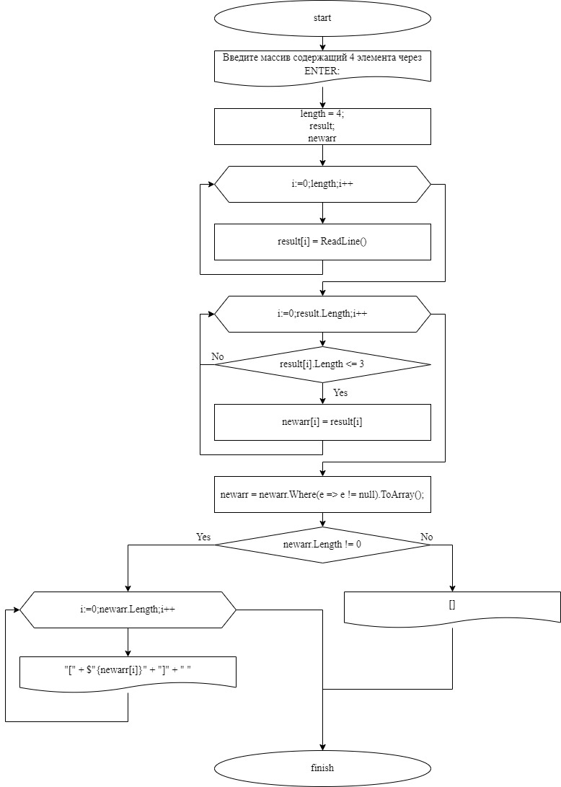

# **Инструкция к итоговой работе**

## *Написать программу, которая из имеющегося массива строк формирует массив из строк, длина которых меньше или равна 3 символа. Первоначальный массив можно ввести с клавиатуры, либо задать на старте выполнения алгоритма. При решении не рекомендуется пользоваться коллекциями, лучше обойтись исключительно массивами*

## **Решение задачи на языке с#**
***
В папке ITOG решение задачи приведено обычным решением

В папке Variant2 решение задачи приведено с помощью методов
***

## **Блок-схема**
чтобы вставить изображение в текст, достаточно написать следующее:
 

## **Ссылка на блок-схему**
[Google.Диск] (https://drive.google.com/file/d/1EEycIHLR2KonnO9Zh4rrk8VWQV6DXqWh/view?usp=sharing) 
***

## **Содержание файла**
1. .gitignore
2. README.md
3. Блок-схема в виде рисунка для первого варианта решения задачи
4. Блок-схема в виде ссылки для первого варианта решения задачи